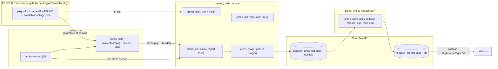
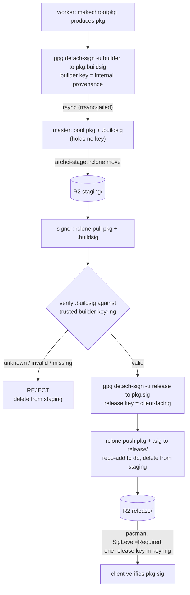

# archci

[](https://github.com/hegjon/archci/actions/workflows/ci.yml)

A headless build farm for Arch Linux packages. One master watches a git
repository of PKGBUILDs, by default
[omarchy-pkgs](https://github.com/hegjon/omarchy-pkgs), for version changes,
any number of workers pull jobs over ssh and build them in clean
btrfs-snapshotted chroots with devtools, and a separate signer verifies,
signs, and publishes the pacman repository to Cloudflare R2. The master holds
no signing key.

The PKGBUILD repository is the manifest: what gets built is exactly what is
merged there, at the commit the master saw. Packages carried from Arch Linux
itself (`source: arch` in omarchy-pkgs, refreshed by its `bin/sync-arch`),
from the AUR, or written locally all look the same to the farm. The
repository URL is one config line (`ARCHCI_PKGBUILDS_URL`), so moving from
one fork to another, say to `omacom/omarchy-pkgs`, is a config change.


> **Status: prototype.** This runs end to end but is not production-hardened.
> Before relying on it, see the checklist in "Notes and limits" (real release
> key, bigger workers, a custom domain for the repo, and so on).

Everything is plain bash and a few small ruby scripts (the scanner, the
next-package picker, and status, sharing one library), plus `ssh`, `git`, `rsync`,
`btrfs`, `systemd` timers and `journald`. There is no daemon: the queue is a directory of
files, and moving a file between `pending/`, `running/`, `done/` and `failed/`
is the whole state machine.



## How it works

**Scanning.** `archci-scan` (ruby, every 10 min) pulls the PKGBUILD
repository (`ARCHCI_PKGBUILDS_URL`, branch `ARCHCI_PKGBUILDS_BRANCH`) into
`pkgbuilds/` and refreshes the package index. `archci-pkgs` builds that index
from every `pkgbuilds/<name>/` holding a PKGBUILD and `.omarchy/package.json`:
the version the PKGBUILD declares (read the way makepkg does, by sourcing it
at file scope with `CARCH` set), the last commit that touched the directory,
its `arch` array, the devtools profile (`multilib` for `arch_repo: multilib`
or a `lib32-` name, else `extra`), the package's `source`, and whether
`skip_build` is set. The index is cached per clone HEAD, so a claim reads one
file. The backlog is never written down: when a worker asks for work,
`archci-next <arch>` walks the index and compares each package's version with
`built/<repo>-<arch>/<name>` (`version commit` of the last successful build),
skipping packages that are running, queued, waiting for a retry or given up
on. Updates to packages already in our repo come first, then the never-built
rest, alphabetically. A commit that changes a package directory without
changing its version does not rebuild it, the same rule omarchy-pkgs' own
pipeline follows; it does drop a pending or failed job for the older commit.
`ARCHCI_PKG_SOURCES` restricts the farm to packages with a given `source`,
for example `arch` for those carried from Arch Linux.

**Architectures.** `ARCHCI_ARCHES` on the master lists the arches it builds
(default `x86_64`); each worker sends its own `ARCHCI_ARCH` with every claim
and only gets jobs for it. A package whose PKGBUILD says `arch=(any)` is one
job, given to workers of `ARCHCI_ANY_ARCH` (default: the first arch listed),
and the resulting package is pooled into every arch's directory, because
pacman fetches all packages from the client's own `$repo/os/$arch`. Every
other package is offered to every enabled arch: a port arch builds PKGBUILDs
that only list x86_64 with `--ignorearch` (see "Building for arm64" below),
unless `ARCHCI_IGNOREARCH=0` limits it to packages that list the arch.

**Workers.** `archci-worker@N` runs `ssh master claim <host>-N <arch>`. The
master's forced command (`archci-shell`) takes the first file in
`queue/pending/` (manual enqueues and retries) the worker's arch can build,
or else asks `archci-next` for the next outstanding package and writes a job
for it. The job goes to `running/` stamped with the worker name and attempt,
and is printed. The worker then:

1. exports `pkgbuilds/<name>/` from the PKGBUILD repository at exactly the
   job's commit (`git archive` out of a bare mirror the worker keeps),
2. starts `archci-build@<repo>-<pkgbase>-<version>-a<attempt>.service`, a
   oneshot template unit, with a blocking `systemctl start`. The build has its
   own unit, cgroup and journal, and the unit's `TimeoutStartSec` (12 h, change
   with `systemctl edit archci-build@.service`) is the timeout,
3. inside that unit, builds with `makechrootpkg -c -l archci-N` in
   `/var/lib/archbuild/<profile>-<arch>`; devtools creates the chroot as a
   btrfs subvolume and each build gets a fresh snapshot of it, refreshed with
   `pacman -Syuu` at most once an hour. The chroot's `makepkg.conf` and
   pacman `<profile>.conf` come from `/etc/archci/<arch>/`, then
   `arch/<arch>/` in the archci tree, then devtools,
4. signs each package with the worker's own builder key (`<pkg>.buildsig`,
   internal provenance, see Signing below),
5. takes the build's journal as `build.log`, and rsyncs it with the packages,
   their builder signatures and makepkg logs to `incoming/<jobid>/` on the
   master (the ssh key is jailed to that directory by `rrsync`),
6. reports `success` or `failure`. The verdict comes from a `result` file
   `archci-build` writes last, not from the unit's exit status, because systemd
   counts a build killed by SIGTERM (an external stop) as a clean exit. A
   `TimeoutStartSec` timeout does fail the unit, but the result file also covers
   the stop/kill case, so the worker relies on it uniformly.

While building, a background loop sends a heartbeat every 5 minutes. A job
without a heartbeat for 30 minutes is put back in `pending/` by the reaper, so
a worker can be destroyed at any time. On `systemctl stop` the worker reports
`abandoned`, which requeues without counting an attempt.

**Master.** The master holds no signing key and builds no database. On `report
success` the packages and their builder signatures are pooled into
`repo/<repo>/os/<arch>/` by the arch in the package's file name (debug
packages go to `<repo>-debug`, `-any` packages into every enabled arch; a
package of another arch fails the job) and the built record is written.
`archci-stage` (a timer) then `rclone move`s the pool to the R2 staging area,
so the master keeps only packages not yet staged. Failures keep their log
under `logs/<repo>/<pkgbase>/<version>/<arch>/attempt-N.log` and are retried
after 3 hours, up to 3 attempts. A newer commit of the package drops any
pending or failed job for the older one; if its version is still not the
built one it is simply outstanding again.

**Signer.** Everything from staging on is the signer's job; see Signing below.
It verifies each package's builder signature, adds the client-facing release
signature, runs `repo-add`, publishes packages + `.sig` + database to the R2
release area that clients use, and deletes the package from staging.

Builds use dependencies from the official Arch mirrors, not from our own
output, so packages can be built in any order and workers stay simple. A
package that depends on another package of the same repository (most
`omarchy-*` packages do) needs that repository in the chroot: copy
`/usr/share/devtools/pacman.conf.d/extra.conf` to
`/etc/archci/<arch>/extra.conf` on the workers and add the repository, our
own R2 release area or the one the PKGBUILDs were written for, above
`[core]`.

## Signing

Signing is a two-stage chain, the internet-facing master never holds a key, and
R2 is the hand-off between master and signer. The signer needs no access to the
master at all; it talks only to R2.



- **Builder signature (internal).** Each worker has its own OpenPGP key,
  generated locally on first start (`archci-worker-setup`). Right after a build the worker
  signs every package into `<pkg>.buildsig`. This proves which builder made
  the package and that its bytes were not altered afterwards. It is never
  shown to clients and is excluded from what is published.
- **Release signature (client-facing).** The `signer` role runs on its own
  droplet and holds the passphrase-protected release key. `archci-sign` (a
  timer) lists the R2 staging area, pulls each package with its builder
  signature, verifies the builder signature against a keyring of authorized
  builder keys, makes the detached release `<pkg>.sig`, runs `repo-add`, and
  publishes packages + `.sig` + database to the R2 release area, then deletes
  the package from staging. A package whose builder signature is missing,
  invalid, or from an unknown key is rejected and never released.

The two signatures live in separate files on purpose. pacman verifies the
client-facing `<pkg>.sig` against the one release key in its keyring; the
builder signatures stay in staging and never reach the release area, so clients
never need per-worker keys. The release private key never leaves the signer: it
is generated there with a passphrase and unlocked once per session into
`gpg-agent` (`archci-sign --unlock`), so the signing timer runs unattended for
the agent's cache lifetime. The database is left unsigned (pacman's default
`DatabaseOptional`); package authenticity is fully covered by the release
signatures. A compromise of the master cannot get a malicious package released:
it holds no key, cannot forge a builder signature, and the signer refuses
anything that fails that check.

Because the hand-off is R2, the signer needs no access to the master, and the
release area is written only by the key holder. It also means neither host must
store the whole repository: R2 does. Use scoped R2 tokens so the master can
only write `staging/` and the signer can read `staging/` and write the release
prefix, and do not serve `staging/` publicly.

Trust bootstrap: export the release public key on the signer and give it to
clients (`pacman-key --add release.pub && pacman-key --lsign-key <fpr>`), and
register each worker's builder public key on the signer once with
`archci-authorize-builder`. Ephemeral fleets can instead share one builder key
baked into the worker image (see `cloud-init/worker.yaml`), registered once.


## Source layout

```
lib/      archci-common.sh (bash) and archci.rb (ruby): config, job files, paths
master/   archci-scan, archci-pkgs, archci-next, archci-job, archci-stage, archci-shell, archci-authorize, archci-status
ssh/      sshd_config.d/archci.conf: sshd reads worker keys from /etc/archci/authorized_keys
worker/   archci-worker, archci-build
arch/     chroot configs for arches devtools ships none for (aarch64/makepkg.conf)
signer/   archci-sign, archci-sign-health, archci-authorize-builder
systemd/  scan, reaper and stage timers (master); archci-worker@.service and
          archci-build@.service (worker); archci-sign and archci-sign-health
          timers (signer); journal-remote drop-ins for the master
```

`install.sh` copies `lib/` plus the role's directory (and `arch/` on a worker)
to `/usr/local/lib/archci` with the same layout and symlinks the role's
scripts into `/usr/local/bin`. `systemd/` also holds
`archci-logging-remote.service`, a worker's journal tunnel (see "Monitoring
workers"). `PKGBUILD` packages the tree the same way
under `/usr/lib/archci`, one package per role, without `install.sh` (see
Install).

## Layout on the master (`/var/lib/archci`)

```
pkgbuilds/                  clone of the PKGBUILD repository (ARCHCI_PKGBUILDS_BRANCH)
pkgbuilds.index             package index over it, keyed by the clone's HEAD (archci-pkgs)
queue/{pending,running,done,failed}/<jobid>.job
built/<repo>-<arch>/<name>  "version commit" of the last good build
                            (one directory per arch, plus <repo>-any)
incoming/<jobid>/           worker uploads (btrfs subvolume, rrsync jail)
repo/<repo>/os/<arch>/      pooled packages awaiting staging (btrfs subvolume)
logs/<repo>/<pkgbase>/<version>/<arch>/attempt-N.log
```

The released repository lives on R2, not on the master. The signer keeps only
the databases locally, in `/var/lib/archci-signer/repo/`.

A job file (the id ends with the arch; `any` for an arch-independent package;
`pkgbase` is the package directory, `commit` the PKGBUILD repository commit
the build is pinned to, `profile` the devtools build profile):

```
id=1-1788594133-omarchy,linux,7.2.3.arch1-2,x86_64
repo=omarchy
arch=x86_64
pkgbase=linux
version=7.2.3.arch1-2
tag=7.2.3.arch1-2
commit=5ad4989865a52c7b0a7b49f4117714e0b2b31d3d
attempt=1
created=2026-09-05T07:40:00Z
worker=build-a-1
claimed=2026-09-05T07:41:12Z
```

## Install

All three roles (master, worker, signer) run on Arch or Omarchy machines and
are installed as pacman packages. `PKGBUILD` is a split package built from
the git repository (`makepkg -s` in a checkout), one package per role on top
of a shared one:

- `archci-git`: `lib/` under `/usr/lib/archci`, the config as
  `/etc/archci/archci.conf`, and the `archci` user (sysusers)
- `archci-master-git`, `archci-worker-git`, `archci-signer-git`: the role's
  scripts as `/usr/bin` commands, its units in `/usr/lib/systemd/system`,
  its directories (tmpfiles), and its dependencies
- `archci-worker-aarch64-git`: add-on for an x86_64 worker: aarch64 worker
  instances under qemu user-mode emulation (see "Building for arm64")

What a package cannot ship as a file happens on first start: a worker's
`archci-worker-setup.service` generates its keys and configures journal
streaming, the master's sshd is reloaded by a pacman hook, the signer's
keyrings are directories the package creates. What remains is per-site:
keys to authorize, R2 credentials, and enabling units, listed per role
below. The signer needs only R2 access; the master and workers share a VPC.

`install.sh master|worker|signer` installs the same files straight from a
source checkout into `/usr/local` for development; it is not packaged.

### Master

The master droplet is named `master`, and workers reach it as `archci@master`
(add `<private ip> master` to each worker's `/etc/hosts`; the cloud-init
template does this).

```
pacman -U archci-git-*.pkg.tar.zst archci-master-git-*.pkg.tar.zst
systemctl enable --now archci-scan.timer archci-reaper.timer archci-stage.timer
systemctl enable --now systemd-journal-remote.socket   # worker journals
```

The package creates the `archci` user and the state directories under
`/var/lib/archci`. Make `repo` and `incoming` there btrfs subvolumes if the
filesystem allows (`install.sh master` does). Then:

1. Create an R2 bucket and an API token that may write the `staging/` prefix,
   and write `/etc/archci/rclone.conf` (mode 600):

   ```
   [r2]
   type = s3
   provider = Cloudflare
   access_key_id = ...
   secret_access_key = ...
   endpoint = https://<account-id>.r2.cloudflarestorage.com
   ```

2. Edit `/etc/archci/archci.conf`: `ARCHCI_R2_STAGING="r2:<bucket>/staging"`,
   `ARCHCI_ARCHES`, and the PKGBUILD repository: `ARCHCI_PKGBUILDS_URL`
   (default `https://github.com/hegjon/omarchy-pkgs.git`; set it to
   `https://github.com/omacom/omarchy-pkgs.git` to follow that fork, on the
   workers too), `ARCHCI_PKGBUILDS_BRANCH` (`master`), `ARCHCI_REPO`
   (`omarchy`, the pacman repository name produced) and optionally
   `ARCHCI_PKG_SOURCES`. The master needs no release credentials; the signer
   publishes the release area.

3. Authorize worker keys: `archci-authorize worker_key.pub`. This appends
   `command="/usr/local/lib/archci/master/archci-shell",restrict <key>` to
   `/etc/archci/authorized_keys`, so a worker key can do nothing but the
   protocol. sshd reads that file for the archci user through
   `/etc/ssh/sshd_config.d/archci.conf` (installed by `install.sh master` and
   the master package; reload sshd after a package install). It is root's on
   purpose: the archci user, which the forced command and queue scripts run
   as, cannot authorize keys for itself. The signer needs no key on the master.

Clients read the release area (see Signer):

```
[omarchy]
Server = https://<r2 release domain>/$repo/os/$arch
```

### Worker

```
pacman -U archci-git-*.pkg.tar.zst archci-worker-git-*.pkg.tar.zst
systemctl enable --now archci-worker@1
```

`ARCHCI_MASTER` defaults to `archci@master`, so make sure `master` resolves
to the master's address first. The first start runs
`archci-worker-setup.service`: it generates `/etc/archci/worker_key` and the
builder signing key, makes `/var/lib/archbuild` a btrfs subvolume when the
filesystem allows, configures journal streaming from `ARCHCI_JOURNAL_URL`,
and logs the two public keys to authorize:

```
journalctl -u archci-worker-setup            # the keys and the commands to run
archci-authorize '<the ssh key line>'        # on the master
archci-authorize-builder builder_key.pub     # on the signer
```

Then:

```
systemctl enable --now archci-worker@2                 # more instances = parallel builds
journalctl --namespace=archci -u archci-worker@1 -f    # the loop: claims, results, uploads
systemctl list-units 'archci-build@*'                  # builds running right now
journalctl --namespace=archci -u 'archci-build@*' -f   # their output
```

`archci-worker@N` builds this machine's own arch (`ARCHCI_ARCH`, default
`uname -m`). `archci-worker-<arch>@N` instances build another arch and run
alongside; the master knows them as `<host>-<arch>-N`.

The worker and build units log to the `archci` journal namespace
(`LogNamespace=archci`), a journald instance of its own with files under
`/var/log/journal/<machine-id>.archci/` and limits in
`journald@archci.conf` (4 GB by default, no rate limit). Plain `journalctl
-u archci-worker@1` shows nothing; add `--namespace=archci`, or
`--namespace='*'` for everything. This is what makes the streaming below
carry archci output only.

The host's `/etc/pacman.d/mirrorlist` is copied into the chroot, so give
workers a fast mirror (`https://geo.mirror.pkgbuild.com/$repo/os/$arch`).

`cloud-init/worker.yaml` is a Digital Ocean user-data template that does all
of this on first boot, so workers are created and destroyed with
`doctl compute droplet create/delete`. The same worker key can be shared by
all droplets; workers are identified by hostname, which on DO is the droplet
name. The master may run `archci-worker@1` too if `master` resolves to itself.

### Building for arm64 (aarch64)

Arch Linux itself releases only x86_64: PKGBUILDs carried from it say
`arch=(x86_64)`, devtools ships no aarch64 `makepkg.conf`, and the official
mirrors carry no aarch64 binaries. archci therefore treats aarch64 as a port,
the way the [Arch Linux Ports](https://ports.archlinux.page/) project does: it
builds the same package list at the same commits, passes `--ignorearch` to
makepkg, and takes the base system for the chroot from a third-party aarch64
repo. Expect a long tail of packages that need patches (the kernel,
bootloaders, x86 assembly). Those patches live in the PKGBUILD repository:
omarchy-pkgs keeps them in `pkgbuilds/<name>/.omarchy/patches/` and reapplies
them on every sync from Arch, so a fix is a pull request there, and the
farm builds it once merged. Until then the package stays in `queue/failed`.

1. **Master:** `ARCHCI_ARCHES="x86_64 aarch64"` in `/etc/archci/archci.conf`.
   The `any` packages keep being built by x86_64 workers (`ARCHCI_ANY_ARCH`)
   and are pooled for both arches.
2. **A native aarch64 worker.** Digital Ocean has no ARM droplets; Hetzner
   CAX, Oracle Ampere and AWS Graviton do. Install Arch for aarch64 from the
   Ports project (bootstrap tarballs and the pacman.conf `Server` line are on
   its [aarch64 page](https://ports.archlinux.page/aarch64/), ARMv8.2 and up
   only) or [Arch Linux ARM](https://archlinuxarm.org/). Point the host's
   `/etc/pacman.d/mirrorlist` at that repo and trust its signing key with
   `pacman-key`: devtools' pacman.conf includes the host mirrorlist and
   `arch-nspawn` copies the host's pacman trust into the chroot, so the
   chroot needs no pacman config of its own. Then install the worker
   package as on any worker: `ARCHCI_ARCH` defaults to `uname -m`, so
   `archci-worker@N` builds aarch64 there. The chroot's
   `makepkg.conf` is `arch/aarch64/makepkg.conf` from this tree (devtools'
   x86_64 flags with `-march=armv8-a` and `-mbranch-protection=standard`);
   copy it to `/etc/archci/aarch64/makepkg.conf` to change it, and put a
   `/etc/archci/aarch64/extra.conf` there if the chroot should use a
   different pacman config than the host, for example this repo's own
   aarch64 output.
3. Watch `archci-status`: `built` is reported per `<repo>-<arch>`, and
   `archci-job enqueue REPO PKGBASE 0 aarch64` queues one package by hand.

**An emulated worker instead.** An x86_64 machine can build aarch64 through
QEMU user-mode emulation. It is 5 to 20 times slower per core and some test
suites break under it, so it suits a big desktop or a smoke test rather than
a fleet, but it needs no ARM hardware:

```
pacman -U archci-worker-aarch64-git-*.pkg.tar.zst
systemctl enable --now archci-worker-aarch64@1
```

The package pulls in `qemu-user-static-binfmt` and ships what devtools lacks:
`/etc/binfmt.d/qemu-aarch64-static.conf`, the stock registration with the C
flag added (F lets binaries inside the chroot find the emulator, C lets
setuid ones such as makepkg's `sudo pacman` keep root; the stock registration
lacks C); a devtools `setarch` alias (arch-nspawn runs `setarch aarch64`,
which the host rejects without one); `/etc/archci/aarch64/extra.conf`,
devtools' pacman.conf with `Architecture = aarch64`, the Ports repo as
`Server` (the host's mirrorlist is x86_64) and pacman's download sandbox
off (qemu has no Landlock or seccomp); and the Ports repo key
`9B2C213B21883BB65CE2FB900CF25682E6BA0751` as the pacman keyring
`archci-ports-aarch64`, which the package's install script populates into
the host keyring because the chroot inherits the host's trust. The
`archci-worker-aarch64@N` instance runs next to the machine's own
`archci-worker@N` and is known to the master as `<host>-aarch64-N`. Outside
the master's private network add the master's public address as `master` to
`/etc/hosts` and set `ARCHCI_JOURNAL_URL` to `http://127.0.0.1:19532` for
the ssh tunnel (see "Monitoring workers") or `""` for no streaming. Expect
the first build to spend a while creating `/var/lib/archbuild/extra-aarch64`.
From a source checkout, `install.sh worker --arch aarch64` does the same by
hand and makes `archci-worker@N` itself build aarch64.

### Signer

On a dedicated droplet (it needs only R2 access, not the VPC):

```
pacman -U archci-git-*.pkg.tar.zst archci-signer-git-*.pkg.tar.zst
```

The package creates the release and builder keyrings under `/etc/archci`,
the release one with a one-day `gpg-agent` cache. Then: write
`/etc/archci/rclone.conf` and set
`ARCHCI_R2_STAGING` (read) and `ARCHCI_R2_RELEASE` (write) in
`/etc/archci/archci.conf`, create the passphrase-protected release key,
register each worker's builder key with `archci-authorize-builder`, export the
release public key for clients, and:

```
archci-sign --unlock                     # enter the passphrase once per session
systemctl start archci-sign.timer        # sign new packages every 2 minutes
systemctl start archci-sign-health.timer # warn if signing stalls
journalctl -u archci-sign -f
```

The release key is unlocked into `gpg-agent`, whose cache expires (default one
day, `max-cache-ttl` in the release keyring's `gpg-agent.conf`). When it lapses
signing stops silently and packages pile up in staging, so `archci-sign-health`
(a timer) tests the key with `gpg --pinentry-mode error` and checks the staging
depth, and warns loudly into the journal — `ALERT: release key is LOCKED ...` or
a backlog warning past `ARCHCI_STAGING_WARN`. Re-run `archci-sign --unlock` when
you see it. The journal streams to the master, so
`journalctl -D /var/log/journal/remote -t archci-sign-health` surfaces it there.

### Using the repo (client)

On a client, import the release public key and point pacman at the release URL:

```
pacman-key --add release.pub && pacman-key --lsign-key <fingerprint>
```

`/etc/pacman.conf`:

```
[core]
SigLevel = Required
Server = https://<r2 release domain>/$repo/os/$arch
```

It then behaves like any pacman repository. Queried from the prototype part way
through building `core` (67 packages so far, abridged; this instance predates
the switch to a PKGBUILD repository and still serves `[core]`):

```
$ pacman -Sl core
core acl 2.4.0-1
core attr 2.6.0-1
core audit 4.2.1-1
core bash 5.3.15-1
core binutils 2.47-4
core btrfs-progs 7.1-1
core cryptsetup 2.8.7-1
core dbus 1.16.2-1
core e2fsprogs 1.47.4-1
core glib2 2.88.3-1
core gnupg 2.4.9-3
core iproute2 7.2.0-1
...
core python-brotli 1.2.0-1

$ pacman -Si core/iproute2
Repository      : core
Name            : iproute2
Version         : 7.2.0-1
Description     : IP Routing Utilities
Architecture    : x86_64
URL             : https://git.kernel.org/pub/scm/network/iproute2/iproute2.git
Licenses        : GPL-2.0-or-later
Provides        : iproute
Depends On      : glibc  libxtables.so=12-64  libcap  libcap.so=2-64  libelf  libbpf  libbpf.so=1-64
Download Size   : 1214.64 KiB
Installed Size  : 3181.61 KiB
Packager        : Unknown Packager
Build Date      : Tue Aug 18 07:37:09 2026
Validated By    : SHA-256 Sum
```

(These 67 packages were built before `ARCHCI_PACKAGER` was set, so they show
`Unknown Packager`; builds now stamp `PACKAGER` from `ARCHCI_PACKAGER`. Either
way the package's authenticity comes from the release signature, which pacman
verifies against the imported key on download, not from that field.)

## Monitoring workers from the master

Workers stream the `archci` journal namespace, and nothing else of their
journal, to the master with `systemd-journal-upload --namespace=archci`
(configured on each worker start by `archci-worker-setup` from
`ARCHCI_JOURNAL_URL`, default `http://master:19532`; `""` streams nothing).
The master receives it with `systemd-journal-remote`
over plain HTTP on the VPC and keeps one file per worker under
`/var/log/journal/remote/`, capped by `journal-remote.conf` (2 GB, 200 files).
Same direction as the job protocol: workers only need the master's name, and
the last lines of a worker that died are already on the master.

A worker outside the private network cannot reach the port, so it streams
through an ssh tunnel instead: `ARCHCI_JOURNAL_URL=http://127.0.0.1:19532`
makes `archci-worker-setup` let `archci-logging-remote.service` start, which holds
`ssh -N -L 127.0.0.1:19532:127.0.0.1:19532 archci@master` open with the
worker key. The master allows that key to forward to this one port and
nothing else (`archci-authorize` writes `port-forwarding,permitopen=...`
after `restrict`, and the sshd drop-in adds `PermitOpen`), and with `-N` no
session is opened, so the forced command never runs. Tunneled workers all
arrive from 127.0.0.1, so they share one `remote-127.0.0.1.journal` file
instead of one each; filter them with `_HOSTNAME=`.

```
journalctl -D /var/log/journal/remote -f                     all workers, live
journalctl -D /var/log/journal/remote -u 'archci-worker@*'   the worker loops only
journalctl -D /var/log/journal/remote -u 'archci-build@*'    every build's output
journalctl -D /var/log/journal/remote -u archci-build@core-linux-7.2.3.arch1-2-a1
journalctl -D /var/log/journal/remote _HOSTNAME=build-a      one worker
journalctl --merge -f                                        master and workers together
```

Because full build output goes through journald and journal-upload, size the
master's `journal-remote.conf` limits and the workers' `journald@archci.conf`
`SystemMaxUse` for it; large builds such as browsers produce hundreds of
megabytes of log.

There is no authentication on the plain-HTTP listener, so bind it to the
master's VPC address only, with a drop-in for the socket:

```
# /etc/systemd/system/systemd-journal-remote.socket.d/vpc.conf
[Socket]
ListenStream=
ListenStream=<private ip>:19532
```

and keep port 19532 closed in the Digital Ocean cloud firewall.

## Operating it

`archci-status` is the at-a-glance view of the farm. A live example from the
prototype, part way through building `core`:

```
archci master status  (2026-09-06T08:34:59Z)

  queue: pending=0  running=2  done=94  failed=11
  outstanding: 0 update(s), 8158 unbuilt
  built: core 51/177  extra 0/8045

  running:
    core/guile 3.0.11-1                      worker1-1            attempt 1  heartbeat 2m ago
    core/kmod 34.2-1                         worker2-1            attempt 1  heartbeat 2m ago

  failed (11, newest first):
    core/grub 2:2.14-1                       worker2-1            attempt 1
    core/gnutls 3.8.13-2                     worker1-1            attempt 1
    core/gpm 1.20.7.r38.ge82d1a6-6           worker2-1            attempt 1
    core/gcc 16.2.1+r23+gd564253eb6c8-1      worker2-1            attempt 3  GAVE UP
    core/glibc 2.44+r24+g16be1518495f-1      worker1-1            attempt 1
    core/gettext 1.0-2                       worker2-1            attempt 1
    core/elfutils 0.196-1                    worker1-1            attempt 3  GAVE UP
    core/dmraid 1.0.0.rc16.3-15              worker1-1            attempt 3  GAVE UP
    core/curl 8.22.0-1                       worker1-1            attempt 3  GAVE UP
    core/coreutils 9.11-2                    worker1-1            attempt 3  GAVE UP
    core/bison 3.8.2-8                       worker1-1            attempt 3  GAVE UP

  recently built:
    core/keyutils 1.6.3-4                    worker2-1            2026-09-06T08:33:00Z
    core/kbd 2.10.0-1                        worker2-1            2026-09-06T08:32:31Z
    core/json-c 0.19-1                       worker2-1            2026-09-06T08:30:18Z
    core/jfsutils 1.1.15-9                   worker2-1            2026-09-06T08:28:59Z
    core/jansson 2.15.1-1                    worker2-1            2026-09-06T08:28:01Z
    core/iw 6.17-1                           worker2-1            2026-09-06T08:27:14Z
    core/iputils 20250605-1                  worker2-1            2026-09-06T08:26:38Z
    core/iptables 1:1.8.13-1                 worker2-1            2026-09-06T08:25:58Z
    core/iproute2 7.2.0-1                    worker2-1            2026-09-06T08:22:47Z
    core/inetutils 2.8-1                     worker2-1            2026-09-06T08:18:52Z
```

The other operator commands:

```
archci-status                       queue counts, running builds, recent failures
archci-status --json                queue/outstanding as JSON
archci-next                         what the next claim would build
journalctl -t archci-job -f         every claim/report on the master
journalctl -u archci-scan           scan results
journalctl -u archci-stage          staging to R2
archci-job enqueue extra firefox    build the current release now (priority 0)
archci-job retry <jobid>            reset attempts of a failed job and requeue
archci-job requeue <jobid>          put a running/failed job back, keep attempts
archci-stage --force                move pooled packages to R2 staging now
archci-build job.file /tmp/out      reproduce a build by hand on a worker (root)

# on the signer
archci-sign --unlock                cache the release passphrase for the session
archci-sign                         sign and publish staged packages now
journalctl -u archci-sign -f        release-signing activity
journalctl -u archci-sign-health    stall alerts (locked key, staging backlog)
archci-authorize-builder key.pub    trust a worker's builder key
```

All knobs are in `archci.conf.example`. Environment variables override the
file, which is how the tests run without network or root. Run them with
`test/run.sh` (add a name substring to filter, e.g. `test/run.sh lint`):

- `test/lint-test.sh` — `bash -n` and `ruby -c` on every script, plus
  `shellcheck` when installed.
- `test/integration-test.sh` — the whole master side (scan, claim, heartbeat,
  report, reap, forced ssh command, rrsync upload), the two-stage signing gate
  with real gpg keys, and the R2 hand-off (master stage, signer verify, reject,
  release-sign, publish, drain) against a local rclone stand-in, in a temp dir.

## Test instance

A live prototype runs on Digital Ocean and publishes what it builds to R2:

- **Repository URL:** `https://pub-771dbcd770ba439baaf9c08e090268f8.r2.dev`
  (the `[omarchy]` repo lives under `omarchy/os/x86_64/`).
- **Fleet:** one master, two build workers, and one signer, all small droplets
  (1 vCPU, 1 GB). It builds the `source: arch` packages of
  [hegjon/omarchy-pkgs](https://github.com/hegjon/omarchy-pkgs)
  (`ARCHCI_PKG_SOURCES=arch`).
- **Release key:** the throwaway demo key, fingerprint
  `1E29618FAE38DE36160903CD60A80B4278269BB3` (uid `archci release TEST`), with
  no passphrase, so the signer runs unattended.

This is a prototype demo, treat it accordingly:

- The release key is a **throwaway** without a passphrase, so the
  signatures prove the pipeline works, not that the packages are trustworthy.
- The workers are undersized, so large packages (gcc, glibc, …) fail; expect
  gaps.
- It may change, be rebuilt, or disappear without notice.

So try it only on a throwaway machine, a VM or container, never a system you
care about. Fetch and trust the demo key (published in the bucket), then add the
repo:

```
curl -O https://pub-771dbcd770ba439baaf9c08e090268f8.r2.dev/release.pub
pacman-key --add release.pub
pacman-key --lsign-key 1E29618FAE38DE36160903CD60A80B4278269BB3
```

`/etc/pacman.conf`:

```
[omarchy]
SigLevel = Required
Server = https://pub-771dbcd770ba439baaf9c08e090268f8.r2.dev/$repo/os/$arch
```

Then `pacman -Sy` and install as shown above.

## Notes and limits

- Nothing is queued up front: with an empty `built/`, every package in the
  PKGBUILD repository (minus `skip_build` and anything `ARCHCI_PKG_SOURCES`
  excludes) is outstanding and gets built in name order, as workers ask for
  work.
- Packages are built independently against the official mirrors (plus
  whatever `/etc/archci/<arch>/extra.conf` adds). If a build needs a newer
  dependency than the mirror has, or a sibling from this repository that is
  not published yet, it fails and is retried later.
- The master sources every PKGBUILD at file scope (as the `archci` user, in
  a clean environment) to read its version, the same thing `makepkg
  --printsrcinfo` does. The PKGBUILD repository is trusted input; do not
  point `ARCHCI_PKGBUILDS_URL` at one you would not run.
- Upstream source PGP signatures are not verified (`ARCHCI_MAKEPKG_ARGS`
  defaults to `--skippgpcheck`): there is no central keyring of packagers'
  upstream keys, so a rebuild farm cannot check them. The build is still
  pinned to the PKGBUILD repository's exact commit and the PKGBUILD sha256sums.
  Clear the setting and seed the build user's keyring to enforce them.
- Packages are signed by the `signer` role, never on the master; the database
  is left unsigned (`DatabaseOptional`). See Signing above. A built package
  whose builder signature the signer rejects is not re-attempted automatically,
  since that indicates a misconfigured or untrusted worker; investigate the
  signer log.
- The signer's `repo-add -R` keeps only the current version of each package in
  the release database, and `archci-sign` then deletes the superseded package
  files from the R2 release area.
- Unsigned packages transit the R2 `staging/` prefix. Keep it private (never
  served publicly) and use scoped R2 tokens: the master writes only `staging/`,
  the signer reads `staging/` and writes the release prefix.
- Prototype gaps to close before production: the release key is generated with a
  passphrase but must be a real key you control (not a throwaway); serve the
  release bucket from a custom domain rather than the rate-limited r2.dev URL;
  give workers enough RAM (1 GB is too little for large packages); and decide on
  release-key longevity (see the signing section).
- Worker ssh keys are shared secrets; rotate by running `archci-authorize` with
  a new key and deleting the old line from `/etc/archci/authorized_keys`.

## License

MIT. See [LICENSE](LICENSE).
