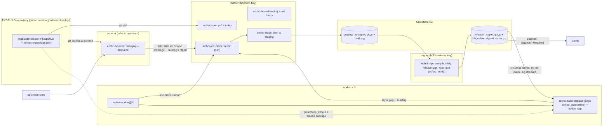
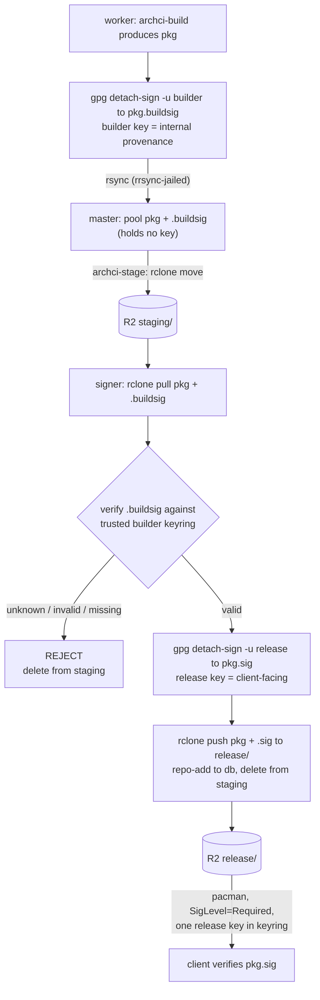

# archci

A headless build farm for Arch Linux packages. One master watches a git
repository of PKGBUILDs, by default
[omarchy-pkgs](https://github.com/hegjon/omarchy-pkgs), for version changes,
any number of workers pull jobs over ssh and build them in clean
btrfs-snapshotted chroots with devtools, and a separate signer verifies,
signs, and publishes the pacman repository to Cloudflare R2. The master holds
no signing key.

The PKGBUILD repository is a Git repository with the structure of
[omacom/omarchy-pkgs](https://github.com/omacom/omarchy-pkgs): one
directory per package under `pkgbuilds/`, holding the `PKGBUILD` and a
`.omarchy/package.json` beside it. archci needs nothing else of the
repository, and reads these keys of that file:

- `source`: `arch` for a package carried from Arch Linux (refreshed by the
  repository's `bin/sync-arch`), `aur`, or `local` for one written there;
  they all look the same to the farm, and `ARCHCI_PKG_SOURCES` can limit
  the farm to some of them
- `arch_repo`: the Arch repository the package comes from, `core`, `extra`
  or `multilib`; `ARCHCI_PKG_REPOS` filters on it, and `multilib` picks the
  devtools profile
- `skip_build`: `true` leaves the package out
- `network`: archci's own, `"loopback"` or `"full"`, for the few builds that
  cannot run without the network (see "How it works"); absent otherwise

The repository is the manifest: what gets built is exactly what is merged
there, at the commit the master saw, and a package's version is what its
PKGBUILD declares. The URL and branch are one config line each
(`ARCHCI_PKGBUILDS_URL`, `ARCHCI_PKGBUILDS_BRANCH`), so any repository with
that structure works, and moving from one fork to another, say from
`hegjon/omarchy-pkgs` to `omacom/omarchy-pkgs`, is a config change.


> **Status: prototype.** This runs end to end but is not production-hardened.
> Before relying on it, see the checklist in "Notes and limits" (real release
> key, bigger workers, a custom domain for the repo, and so on).

A live test farm runs on Digital Ocean. Its front end is at
<https://repo.jonnyware.com/> (read-only), and it publishes the packages it
builds to R2 (see [docs/test-instance.md](docs/test-instance.md)).

Everything is plain bash and a few small ruby scripts (the scanner, the
next-package picker, and top, sharing one library), plus `ssh`, `git`, `rsync`,
`btrfs`, `systemd` timers and `journald`. There is no daemon: the queue is a directory of
files, and moving a file between `pending/`, `running/`, `done/` and `failed/`
is the whole state machine.



## How it works

Each role is a short script run by a systemd timer or unit; there is no
daemon and no central database, only the job files moving through the queue.

**Scanning.** Every couple of minutes the master pulls the PKGBUILD
repository and refreshes an index of every package: the version its PKGBUILD
declares, the commit that last touched it, its architectures, and the keys
from `.omarchy/package.json`. A package is outstanding when the version in
the repository is not the one last built. The backlog is never stored; when
a worker asks for work the master picks the next outstanding package just in
time. The order puts the farm's own packages first, then updates to packages
already published, then the never-built rest, and within each of those a
library before what links it (by the dependency graph) and Arch's core
before extra. `ARCHCI_PKG_SOURCES` and `ARCHCI_PKG_REPOS` narrow what is
built. A commit that changes a package without changing its version does not
rebuild it.

**Architectures.** `ARCHCI_ARCHES` lists the arches the farm builds. Each
worker builds one arch and only claims jobs for it. An `arch=(any)` package
is built once and pooled into every arch. Arch's own PKGBUILDs list x86_64
only, so a port arch builds them under emulation with `--ignorearch`; AUR
and local packages build only where their arch array says (see
[docs/ports.md](docs/ports.md)).

**Workers.** A worker polls the master for a job over ssh, builds it, and
hands back the result. For each job it:

1. takes the source package the sourcer prepared (the recipe, every verified
   source, and the vendored dependencies), or, when there is none, exports
   the PKGBUILD at the job's commit and lets makepkg fetch upstream;
2. builds in a fresh snapshot of a clean devtools chroot, in its own systemd
   unit with its own cgroup and journal, at low priority and under a long
   timeout, killed early only if it goes silent;
3. installs dependencies in a container that has the network, then builds in
   one that has none: the sources come from the package and the vendored
   caches replay offline. A package that must reach itself or the network
   carries a `"network"` flag in its `package.json`, approved per package;
4. signs each package with its own builder key, uploads the packages,
   signatures and log to the master, and reports success or failure.

Results are held and retried while the master is unreachable, so a worker
can be destroyed at any time. While building, a worker heartbeats its own and
the job's stats to the master for `archci top`; a job that stops
heartbeating is requeued.

**Sourcer.** One host talks to upstream. It claims `src` jobs, and for each
runs `makepkg --allsource` in a clean chroot: it downloads every source for
every arch, checksums and signature-checks them, and packs a source package.
When a PKGBUILD fetches an ecosystem's dependencies in prepare() (cargo, go,
npm, pip, maven), it captures that fetch into the package so the build can
replay it offline, and for cargo, go and npm it adds a CycloneDX SBOM of the
vendored dependencies (`sbom.cdx.json`). It
signs the source package and hands it in like a build's; the signer
publishes it beside the arches, and a build claim then names it so the
worker fetches nothing upstream. The sourcer holds no credential but its
keys.

**Master.** The master holds no signing key and no database. It pools each
reported package into its repository directory, records the build, and a
timer moves the pool to the R2 staging area, so it keeps only what is not
yet staged. Failures keep their log and are retried a few times before being
given up on.

**Signer.** Everything from staging on is the signer's job, on its own host
with the release key. It verifies each package's builder signature, adds the
client-facing release signature, runs `repo-add`, and publishes the signed
repository to R2 for clients (see [Signing](#signing) below).

With a release URL configured, a worker's chroots install dependencies from
the farm's own published repository above the Arch mirrors, so a package can
build against a sibling the farm just made and falls back to the mirrors for
everything else.

## Signing

Signing is a two-stage chain, the internet-facing master never holds a key, and
R2 is the hand-off between master and signer. The signer needs no access to the
master at all; it talks only to R2.



- **Builder signature (internal).** Each worker has its own OpenPGP key,
  generated locally on first start (`archci-worker-setup`). Right after a build the worker
  signs every package into `<pkg>.buildsig`. This proves which builder made
  the package and that its bytes were not altered afterwards. It is never
  shown to clients and is excluded from what is published.
- **Release signature (client-facing).** The `signer` role runs on its own
  droplet and holds the passphrase-protected release key. `archci-sign` (a
  timer) lists the R2 staging area, pulls each package with its builder
  signature, verifies the builder signature against a keyring of authorized
  builder keys, makes the detached release `<pkg>.sig`, runs `repo-add`, and
  publishes packages + `.sig` + database to the R2 release area, then deletes
  the package from staging. A package whose builder signature is missing,
  invalid, or from an unknown key is rejected and never released.

The two signatures live in separate files on purpose. pacman verifies the
client-facing `<pkg>.sig` against the one release key in its keyring; the
builder signatures stay in staging and never reach the release area, so clients
never need per-worker keys. The release private key never leaves the signer: it
is generated there with a passphrase and unlocked once per session into
`gpg-agent` (`archci sign --unlock`), so the signing timer runs unattended for
the agent's cache lifetime. The database is left unsigned (pacman's default
`DatabaseOptional`); package authenticity is fully covered by the release
signatures. A compromise of the master cannot get a malicious package released:
it holds no key, cannot forge a builder signature, and the signer refuses
anything that fails that check.

Because the hand-off is R2, the signer needs no access to the master, and the
release area is written only by the key holder. It also means neither host must
store the whole repository: R2 does. Use scoped R2 tokens so the master can
only write `staging/` and the signer can read `staging/` and write the release
prefix, and do not serve `staging/` publicly.

Trust bootstrap: export the release public key on the signer and give it to
clients (`pacman-key --add release.pub && pacman-key --lsign-key <fpr>`), and
register each worker's builder public key on the signer once with
`archci authorize-builder`. Ephemeral fleets can instead share one builder key
baked into the worker image (see `cloud-init/worker.yaml`), registered once.


## Source layout

```
bin/      archci-master, archci-signer, archci-sourcer, archci-worker: the role's command line, installed as /usr/bin/archci; `archci <name>` runs archci-<name> of the role (a worker's: version only)
tools/    release-pkgbuild: writes the fork's PKGBUILD for a tag from PKGBUILD here (developers)
lib/      archci-common.sh, archci-queue.sh (bash), archci.rb (ruby): config, the job queue, paths
master/   archci-scan, archci-pkgindex, archci-next, archci-job, archci-stage, archci-shell, archci-authorize, archci-signer-status, archci-top, archci-failed, archci-jobs, archci-web
          archci-housekeeping: the queue's timer pass, run by its timer, not a command
worker/   archci-worker, archci-build, archci-worker-setup, archci-qemu-setup
signer/   archci-sign, archci-sign-health, archci-authorize-builder
sourcer/  archci-sourcer: the outstanding packages' sources fetched into source packages on R2 for the workers
remote-logging/  archci-logging-setup: the journal streaming configuration from ARCHCI_JOURNAL_URL
test/     the test suite (test/run.sh), run by the PKGBUILD's check() and by GitHub Actions (.github/workflows/test.yml) on every push
arch/     chroot configs for arches devtools ships none for: <arch>/makepkg.conf (and .d/) and qemu/ for aarch64 and riscv64
config/   what the packages install outside /usr/lib/archci:
  archci.conf  the stub installed as /etc/archci/archci.conf (only what differs from the defaults)
  archci.conf.example  every setting, annotated, installed under /usr/share/doc/archci
  systemd/  archci.sysusers, then one folder per role: master/ (the archci-master.target
            that is the role, its units, timers, the journal receiver and its conf, tmpfiles), worker/ (units, tmpfiles),
            signer/ (units, timers, tmpfiles), sourcer/ (unit, timer, tmpfiles),
            remote-logging/ (the journal tunnel and namespace, the upload drop-in)
  ssh/      sshd_config.d/60-archci.conf: worker keys from /etc/archci/authorized_keys
  pacman/   the hook that reloads sshd when that drop-in is installed
  gnupg/    the signer's release keyring gpg-agent.conf
```

`PKGBUILD` packages the tree with the same layout under `/usr/lib/archci`,
one package per role (see Install).

## Layout on the master (`/var/lib/archci`)

```
pkgbuilds/                  clone of the PKGBUILD repository (ARCHCI_PKGBUILDS_BRANCH)
pkgbuilds.index             package index over it, keyed by the clone's HEAD (archci-pkgindex)
queue/{pending,running,done,failed}/<jobid>.job
built/<repo>-<arch>/<name>  "version commit" of the last good build; for an any
                            package also the arches it was pooled for
                            (one directory per arch, plus <repo>-any); for
                            <repo>-src the source package's file name
incoming/<jobid>/           worker uploads (btrfs subvolume, rrsync jail)
repo/<repo>/os/<arch>/      pooled packages awaiting staging (btrfs subvolume); os/src the source packages (each carries <pkgbase>/sbom.cdx.json for a Rust package)
logs/<repo>/<pkgbase>/<version>/<arch>/attempt-N.log   also copied to ARCHCI_R2_LOGS if set (archci-stage; local kept)
released/<repo>-<arch>      what the release holds, "name version" per line, and <repo>-src its
                            source packages (archci-signer-status, a timer); a claim reads them
hosts/<worker>              the last idle poll of each worker, with its host stats (for archci top)
signer.status               the signer as seen through R2 (archci-signer-status, a timer)
```

The released repository lives on R2, not on the master. The signer keeps only
the databases locally, in `/var/lib/archci-signer/repo/`.

A job file (the id ends with the arch; `any` for an arch-independent package,
`src` for the sourcer's fetch; `pkgbase` is the package directory, `commit`
the PKGBUILD repository commit the build is pinned to, `profile` the
devtools build profile, `sources` the released source package the claim
found for the commit, `network` the package's `"network"` flag, `loopback`
or `full`, when it has one):

```
id=1-1788594133-omarchy,linux,7.2.3.arch1-2,x86_64
repo=omarchy
arch=x86_64
pkgbase=linux
version=7.2.3.arch1-2
commit=5ad4989865a52c7b0a7b49f4117714e0b2b31d3d
profile=extra
attempt=1
created=2026-09-05T07:40:00Z
worker=build-a-1
claimed=2026-09-05T07:41:12Z
sources=linux-7.2.3.arch1-2.src.tar.gz
```

## Install

Every role runs on an Arch or Omarchy machine whose state directories are on
btrfs: the master's `/var/lib/archci` (subvolumes for the pool and the
uploads), a worker's `/var/lib/archbuild` (devtools' snapshot-based clean
chroots), and the PKGBUILD clone, whose files carry the package index's
data as extended attributes. That is a requirement, not an option; the
packages depend on btrfs-progs. The roles
are installed as pacman packages. `PKGBUILD` is a split package built from
a tagged release (the farm builds and publishes it like any other package,
see [docs/operating.md](docs/operating.md) "Releasing"), one package per
role on top of a shared one:

- `archci`: `lib/` under `/usr/lib/archci`, the config as
  `/etc/archci/archci.conf`, and the `archci` user (sysusers)
- `archci-remote-logging`: the `archci` journal namespace and its streaming
  to the master through an ssh tunnel over the worker key; the workers and
  the sourcer depend on it
- `archci-master`, `archci-worker`, `archci-signer`, `archci-sourcer`: the role's
  scripts under `/usr/lib/archci/<role>/` (run by its units), its units in
  `/usr/lib/systemd/system`, its directories (tmpfiles), and its dependencies;
  each also installs its `archci <name>` command line as `/usr/bin/archci`,
  the master's and the signer's with bash completion. A worker has no
  commands to run by hand, so it knows `archci version` only
- `archci-worker-qemu-aarch64`, `archci-worker-qemu-riscv64`: add-ons
  for an x86_64 worker: aarch64 or riscv64 worker
  instances under qemu user-mode emulation (see [docs/ports.md](docs/ports.md))

What a package cannot ship as a file happens on first start: a worker's
`archci-worker-setup.service` generates its keys, `archci-logging-setup.service`
configures journal streaming, the master's sshd is reloaded by a pacman hook, the signer's
keyrings are directories the package creates. What remains is per-site:
keys to authorize, R2 credentials, and enabling units, listed per role
below. The signer needs only R2 access; workers need only ssh to the master.

With the farm's repository in `pacman.conf` (see
[docs/test-instance.md](docs/test-instance.md)), `pacman -S archci-<role>`
installs a role and `pacman -Syu` upgrades it with each release. To try a
change before a release, copy the changed file over the installed one under
`/usr/lib/archci/` (a worker re-executes itself when its script changes;
the next upgrade overwrites the copy).

### Master

The master droplet is named `master`, and workers reach it as `archci@master`
(add `<private ip> master` to each worker's `/etc/hosts`; the cloud-init
template does this).

```
pacman -S archci-master
systemctl enable --now archci-master.target
```

The target is the role: it starts the master's timers (`archci-scan`,
`archci-housekeeping`, `archci-stage`, `archci-signer-status`), the
receiver for the workers' journals (`archci-journal-remote`) and sshd,
which the workers come in over, and has them start at boot; stopping it
stops them all, disabling it keeps them from starting at boot. Each can
still be enabled or stopped on its own (`systemctl stop archci-scan.timer`
pauses the sync alone).

The package creates the `archci` user and the state directories under
`/var/lib/archci`, on btrfs. Make `repo` and `incoming` there subvolumes.
Then:

1. Create an R2 bucket and an API token that may write the `staging/` prefix
   (and the `logs/` prefix if you set `ARCHCI_R2_LOGS` to archive build logs),
   and write `/etc/archci/rclone.conf` (mode 600):

   ```
   [r2]
   type = s3
   provider = Cloudflare
   access_key_id = ...
   secret_access_key = ...
   endpoint = https://<account-id>.r2.cloudflarestorage.com
   ```

2. Edit `/etc/archci/archci.conf`: `ARCHCI_R2_STAGING="r2:<bucket>/staging"`,
   `ARCHCI_ARCHES`, and the PKGBUILD repository: `ARCHCI_PKGBUILDS_URL`
   (default `https://github.com/hegjon/omarchy-pkgs.git`; set it to
   `https://github.com/omacom/omarchy-pkgs.git` to follow that fork, on the
   workers too), `ARCHCI_PKGBUILDS_BRANCH` (`core+extra`), `ARCHCI_REPO`
   (`omarchy`, the pacman repository name produced) and optionally
   `ARCHCI_PKG_SOURCES`. The master needs no release credentials; the signer
   publishes the release area.

3. Authorize worker keys: `archci authorize worker_key.pub`. This appends
   `command="/usr/lib/archci/master/archci-shell",restrict <key>` to
   `/etc/archci/authorized_keys`, so a worker key can do nothing but the
   protocol (`--sourcer` restricts a key to `src` jobs, `--web` to what a
   web front end does, see below). sshd reads that file for the archci user through
   `/etc/ssh/sshd_config.d/60-archci.conf` (installed by the master package,
   whose pacman hook reloads sshd). It is root's on
   purpose: the archci user, which the forced command and queue scripts run
   as, cannot authorize keys for itself. The signer needs no key on the master.

Clients read the release area (see Signer):

```
[omarchy]
Server = https://<r2 release domain>/$repo/os/$arch
```

### Worker

```
pacman -S archci-worker
systemctl enable --now archci-worker@1
```

`ARCHCI_MASTER` defaults to `archci@master`, so make sure `master` resolves
to the master's address first. The first start runs
`archci-worker-setup.service`: it generates `/etc/archci/worker_key` and the
builder signing key, makes `/var/lib/archbuild` a btrfs subvolume, and logs
the two public keys to authorize
(`archci-logging-setup.service`, from archci-remote-logging, configures the
journal streaming from `ARCHCI_JOURNAL_URL`):

```
journalctl -u archci-worker-setup            # the keys and the commands to run
archci authorize '<the ssh key line>'         # on the master
archci authorize-builder builder_key.pub      # on the signer
```

Then:

```
systemctl enable --now archci-worker@2                 # more instances = parallel builds
journalctl --namespace=archci -u archci-worker@1 -f    # the loop: claims, results, uploads
systemctl list-units 'archci-build@*'                  # builds running right now
journalctl --namespace=archci -u 'archci-build@*' -f   # their output
```

`archci-worker@N` builds this machine's own arch (`ARCHCI_ARCH`, default
`uname -m`). `archci-worker-<arch>@N` instances build another arch and run
alongside; the master knows them as `<host>-<arch>-N`.

The worker and build units log to the `archci` journal namespace
(`LogNamespace=archci`), a journald instance of its own with files under
`/var/log/journal/<machine-id>.archci/` and limits in
`journald@archci.conf` (4 GB by default, no rate limit). Plain `journalctl
-u archci-worker@1` shows nothing; add `--namespace=archci`, or
`--namespace='*'` for everything. This is what makes the streaming below
carry archci output only.

The host's `/etc/pacman.d/mirrorlist` is copied into the chroot, so give
workers a fast mirror (`https://geo.mirror.pkgbuild.com/$repo/os/$arch`).

`cloud-init/worker.yaml` is a Digital Ocean user-data template that does all
of this on first boot, so workers are created and destroyed with
`doctl compute droplet create/delete`. The same worker key can be shared by
all droplets; workers are identified by hostname, which on DO is the droplet
name. The master may run `archci-worker@1` too if `master` resolves to itself.

### Sourcer

The one host that talks to upstream. On a droplet of its own, or next to an
idle worker (the packages do not conflict):

```
pacman -S archci-sourcer
```

It speaks to the master like a worker: a key at `ARCHCI_WORKER_KEY`
(`ssh-keygen -t ed25519 -N '' -f /etc/archci/worker_key`, then
`archci authorize --sourcer` on the master with its public key, which lets
that key claim `src` jobs and nothing else) and `ARCHCI_MASTER` in
`/etc/archci/archci.conf`. It signs what it makes with a builder key like a
worker's (made at its first start; `archci authorize-builder` on the signer
with `/etc/archci/builder_key.pub`). Then:

```
systemctl enable --now archci-sourcer.service
```

It claims `src` jobs from the master, in claim order, and for each runs
`makepkg --allsource` on the PKGBUILD at the job's commit in a clean
chroot (devtools; `ARCHCI_CHROOTS` on btrfs for a snapshot per job): every
source of every arch downloaded, checksummed and signature-checked, the
cargo, go, npm, pip or maven packages its prepare() fetches captured
under `vendor/`, and packed as
`<pkgbase>-<version>.src.tar.gz`, which it hands in like a build's
packages; the signer releases it under `<repo>/os/src/`. Workers with
`ARCHCI_RELEASE_URL` take source packages from there; without it they fetch
upstream as before. `archci job enqueue PKGBASE 0 src` on the master
fetches a package's sources now.

### Web front end

The farm has no web server. A front end runs on a host of its own and
reads the master over ssh with a key of the `web` role, the way the
signer is a host of its own on the other side of R2:

```
archci authorize --web web_key.pub        # on the master
ssh archci@master snapshot | jq .         # from the web host: the farm and every job, as JSON
ssh archci@master log <jobid>             # one job's log: its archived log, or a running build's journal tail
ssh archci@master retry <jobid>           # and requeue, enqueue: the operator's queue commands, logged as the web key's
```

`archci web snapshot`, `archci web job ID` and `archci web log ID` are the
same commands on the master itself. The snapshot is what `archci top` shows (queue, hosts, running
and failed jobs, the signer) plus every job the master holds with its state,
origin and story, so a front end polls one command and filters in the
browser. The web key claims nothing, uploads nothing and reads no file the
master does not hand it. The front end in use is
[archci-web](https://github.com/hegjon/archci-web), a Rails application
without a database, which talks to the master this way.

### Signer

On a dedicated droplet (it needs only R2 access, not the VPC):

```
pacman -S archci-signer
```

The package creates the release and builder keyrings under `/etc/archci`,
the release one with a one-day `gpg-agent` cache. Then: write
`/etc/archci/rclone.conf` and set
`ARCHCI_R2_STAGING` (read) and `ARCHCI_R2_RELEASE` (write) in
`/etc/archci/archci.conf`, create the passphrase-protected release key,
register each worker's builder key with `archci-authorize-builder`, export the
release public key for clients, and:

```
archci sign --unlock                      # enter the passphrase once per session
systemctl start archci-sign.timer        # sign new packages every minute
systemctl start archci-sign-health.timer # warn if signing stalls
journalctl -u archci-sign -f
```

The release key is unlocked into `gpg-agent`, whose cache expires (default one
day, `max-cache-ttl` in the release keyring's `gpg-agent.conf`). When it lapses
signing stops silently and packages pile up in staging, so `archci-sign-health`
(a timer) tests the key with `gpg --pinentry-mode error` and checks the staging
depth, and warns loudly into the journal — `ALERT: release key is LOCKED ...` or
a backlog warning past `ARCHCI_STAGING_WARN`. Re-run `archci sign --unlock` when
you see it. The journal streams to the master, so
`journalctl -D /var/lib/archci/journal -t archci-sign-health` surfaces it there.

### Using the repo (client)

On a client, import the release public key and point pacman at the release URL:

```
pacman-key --add release.pub && pacman-key --lsign-key <fingerprint>
```

`/etc/pacman.conf`:

```
[core]
SigLevel = Required DatabaseOptional
Server = https://<r2 release domain>/$repo/os/$arch
```

It then behaves like any pacman repository. Queried from a client of the
test instance ([docs/test-instance.md](docs/test-instance.md)), whose
repository is called `hegjon-test` and held 970 x86_64 packages at the time:

```
$ pacman -Sl hegjon-test | head -3
hegjon-test a52dec 0.8.0-3
hegjon-test aalib 1.4rc5-19
hegjon-test abseil-cpp 20260817.0-2 [installed]

$ pacman -Si hegjon-test/rclone
Repository      : hegjon-test
Name            : rclone
Version         : 1.75.1-1
Description     : rsync for cloud storage
Architecture    : x86_64
URL             : https://github.com/rclone/rclone
Licenses        : MIT
Depends On      : glibc
Download Size   : 29.55 MiB
Installed Size  : 109.66 MiB
Packager        : Jonny Heggheim <hegjon@gmail.com>
Build Date      : Thu 10 Sep 2026 12:41:15 AM CEST
```

`Packager` is `ARCHCI_PACKAGER`. The package's authenticity comes from the
release signature, which pacman verifies against the imported key on
download, not from that field.

## Documentation

- [docs/operating.md](docs/operating.md): the day-to-day commands, tests
- [docs/monitoring.md](docs/monitoring.md): worker journals on the master
- [docs/ports.md](docs/ports.md): building for aarch64 and riscv64, native or emulated
- [docs/test-instance.md](docs/test-instance.md): the live test instance

## Notes and limits

- Nothing is queued up front: with an empty `built/`, every package in the
  PKGBUILD repository (minus `skip_build` and anything `ARCHCI_PKG_SOURCES`
  or `ARCHCI_PKG_REPOS` excludes) is outstanding and gets built in the
  claim order above, as workers ask for work.
- Packages are built independently against the farm's own repository and
  the official mirrors (plus whatever `/etc/archci/<arch>/extra.conf` adds).
  If a build needs a newer dependency than either has, or a sibling from
  this repository that is not published yet, it fails and is retried later.
- The master sources every PKGBUILD at file scope (as the `archci` user, in
  a clean environment) to read its version, the same thing `makepkg
  --printsrcinfo` does. The PKGBUILD repository is trusted input; do not
  point `ARCHCI_PKGBUILDS_URL` at one you would not run.
- Upstream source PGP signatures are verified against the keys each
  PKGBUILD names in `validpgpkeys`: the sourcer (or `archci-build`, for a
  build without a source package) imports the copies the
  package ships in `keys/pgp/<fingerprint>.asc`, as Arch's packaging
  repositories do, then refreshes those fingerprints from `ARCHCI_KEYSERVERS`,
  since the shipped copies lag a maintainer's new signing subkey or extended
  expiry. The PKGBUILD repository still decides which keys are trusted; a
  signature by any other key fails. `ARCHCI_MAKEPKG_ARGS=--skippgpcheck`
  turns the check off.
- Packages are signed by the `signer` role, never on the master; the database
  is left unsigned (`DatabaseOptional`). See Signing above. A built package
  whose builder signature the signer rejects is not re-attempted automatically,
  since that indicates a misconfigured or untrusted worker; investigate the
  signer log.
- The signer's `repo-add -R` keeps only the current version of each package in
  the release database, and `archci-sign` then deletes the superseded package
  files from the R2 release area.
- Unsigned packages transit the R2 `staging/` prefix. Keep it private (never
  served publicly) and use scoped R2 tokens: the master writes only `staging/`,
  the signer reads `staging/` and writes the release prefix.
- Prototype gaps to close before production: the release key is generated with a
  passphrase but must be a real key you control (not a throwaway); serve the
  release bucket from a custom domain rather than the rate-limited r2.dev URL;
  give workers enough RAM (1 GB is too little for large packages); decide on
  release-key longevity (see the signing section); and go through the
  packages whose builds need `"network"`, which is granted by hand, per
  package, never by the farm.
- Worker ssh keys are shared secrets; rotate with `archci authorize` for the
  new key and `archci authorize --revoke` for the old one.

## License

MIT. See [LICENSE](LICENSE).
