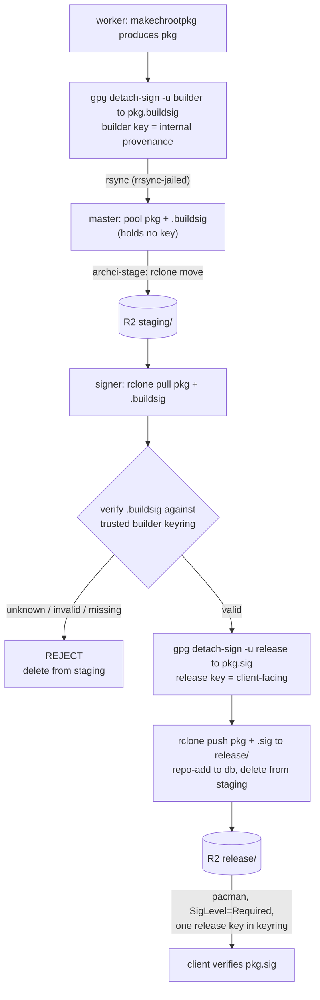

# archci

A headless build farm for Arch Linux packages. One master watches a git
repository of PKGBUILDs, by default
[omarchy-pkgs](https://github.com/hegjon/omarchy-pkgs), for version changes,
any number of workers pull jobs over ssh and build them in clean
btrfs-snapshotted chroots with devtools, and a separate signer verifies,
signs, and publishes the pacman repository to Cloudflare R2. The master holds
no signing key.

The PKGBUILD repository is the manifest: what gets built is exactly what is
merged there, at the commit the master saw. Packages carried from Arch Linux
itself (`source: arch` in omarchy-pkgs, refreshed by its `bin/sync-arch`),
from the AUR, or written locally all look the same to the farm. The
repository URL is one config line (`ARCHCI_PKGBUILDS_URL`), so moving from
one fork to another, say to `omacom/omarchy-pkgs`, is a config change.


> **Status: prototype.** This runs end to end but is not production-hardened.
> Before relying on it, see the checklist in "Notes and limits" (real release
> key, bigger workers, a custom domain for the repo, and so on).

Everything is plain bash and a few small ruby scripts (the scanner, the
next-package picker, and top, sharing one library), plus `ssh`, `git`, `rsync`,
`btrfs`, `systemd` timers and `journald`. There is no daemon: the queue is a directory of
files, and moving a file between `pending/`, `running/`, `done/` and `failed/`
is the whole state machine.


## How it works

**Scanning.** `archci-scan` (ruby, every 10 min) pulls the PKGBUILD
repository (`ARCHCI_PKGBUILDS_URL`, branch `ARCHCI_PKGBUILDS_BRANCH`) into
`pkgbuilds/` and refreshes the package index. `archci-pkgs` builds that index
from every `pkgbuilds/<name>/` holding a PKGBUILD and `.omarchy/package.json`:
the version the PKGBUILD declares (read the way makepkg does, by sourcing it
at file scope with `CARCH` set), the last commit that touched the directory,
its `arch` array, the devtools profile (`multilib` for `arch_repo: multilib`
or a `lib32-` name, else `extra`), the package's `source`, and whether
`skip_build` is set. The index is cached per clone HEAD, so a claim reads one
file. The backlog is never written down: when a worker asks for work,
`archci next <arch>` walks the index and compares each package's version with
`built/<repo>-<arch>/<name>` (`version commit` of the last successful build;
for an `any` package also the arches it was pooled for, so enabling an arch
later makes those packages outstanding again),
skipping packages that are running, queued, waiting for a retry or given up
on. The farm's own packages (`ARCHCI_PKG_ALSO`) come first, then updates to
packages already in our repo before the never-built rest; within each of
those, packages whose dependencies from this repository are all built
before those still waiting for one (the index records each PKGBUILD's
`depends`, `makedepends` and `checkdepends`, so a library goes before what
links it), then Arch's core before extra before multilib, then local and
AUR packages, alphabetically. A commit that changes a package directory without
changing its version does not rebuild it, the same rule omarchy-pkgs' own
pipeline follows; it does drop a pending or failed job for the older commit.
`ARCHCI_PKG_SOURCES` restricts the farm to packages with a given `source`,
for example `arch` for those carried from Arch Linux; `ARCHCI_PKG_ALSO`
names packages built regardless, such as archci itself.

**Architectures.** `ARCHCI_ARCHES` on the master lists the arches it builds
(default `x86_64`); each worker sends its own `ARCHCI_ARCH` with every claim
and only gets jobs for it. A package whose PKGBUILD says `arch=(any)` is one
job, given to workers of `ARCHCI_ANY_ARCH` (default: the first arch listed),
and the resulting package is pooled into every arch's directory, because
pacman fetches all packages from the client's own `$repo/os/$arch`. Every
other package is offered to the enabled arches its arch array lists; Arch's
own PKGBUILDs, which list x86_64 only, a port arch builds anyway with
`--ignorearch` (see [docs/ports.md](docs/ports.md)), unless
`ARCHCI_IGNOREARCH=0` limits it to packages that list the arch. An AUR or
local package is built only where its arch array says.

**Workers.** `archci-worker@N` runs `ssh master claim <host>-N <arch>` once a
minute, with the host's load, memory, disk and vendor, which the master keeps
per worker for `archci top` while the worker is idle. The
master's forced command (`archci-shell`) takes the first file in
`queue/pending/` (manual enqueues and retries) the worker's arch can build,
or else asks `archci next` for the next outstanding package and writes a job
for it. The job goes to `running/` stamped with the worker name and attempt,
and is printed. The worker then:

1. exports `pkgbuilds/<name>/` from the PKGBUILD repository at exactly the
   job's commit (`git archive` out of a bare mirror the worker keeps),
2. starts `archci-build@<repo>-<pkgbase>-<version>-a<attempt>.service`, a
   oneshot template unit, with a blocking `systemctl start`. The build has its
   own unit, cgroup and journal, runs at low CPU and I/O priority (`Nice=15`,
   inherited by everything inside the chroot, so sshd and the worker loop
   stay responsive on a busy build machine), and the unit's `TimeoutStartSec` (12 h, change
   with `systemctl edit archci-build@.service`) is the timeout. A build whose
   output stops for `ARCHCI_BUILD_MAX_IDLE_MINUTES` (90) is killed earlier: a hung
   test suite otherwise holds the worker for the whole 12 h,
3. inside that unit, builds with `makechrootpkg -c -l archci-N` in
   `/var/lib/archbuild/<profile>-<arch>`; devtools creates the chroot as a
   btrfs subvolume and each build gets a fresh snapshot of it, refreshed with
   `pacman -Syuu` at most once an hour. The chroot's `makepkg.conf` and
   pacman `<profile>.conf` come from `/etc/archci/<arch>/`, then
   `arch/<arch>/` in the archci tree, then devtools; `ARCHCI_BUILD_ENV`
   adds a makepkg.conf drop-in with variables every build sees (by default
   CMake's policy minimum, so projects with an old `cmake_minimum_required`
   still configure). A worker building another arch than the machine's runs
   under qemu user-mode emulation and skips `check()` there
   (`ARCHCI_EMULATED_NOCHECK`),
4. signs each package with the worker's own builder key (`<pkg>.buildsig`,
   internal provenance, see Signing below),
5. takes the build's journal as `build.log`, and rsyncs it with the packages,
   their builder signatures and makepkg logs to `incoming/<jobid>/` on the
   master (the ssh key is jailed to that directory by `rrsync`),
6. reports `success` or `failure`; while the master is unreachable (a
   reboot, a night, a weekend) the results are kept and upload and report
   retried every 30 s until it is back, with a heartbeat first so the master
   does not requeue the job as stale when it returns. The verdict comes from a `result` file
   `archci-build` writes last, not from the unit's exit status, because systemd
   counts a build killed by SIGTERM (an external stop) as a clean exit. A
   `TimeoutStartSec` timeout does fail the unit, but the result file also covers
   the stop/kill case, so the worker relies on it uniformly.

While building, the worker sends heartbeats to the master, carrying the
machine's load, memory, chroot disk use and core count, and the job's own
phase (makepkg's step, from the build's output), CPU, memory and build-tree
size read from its cgroup; the master keeps them
with the job for `archci top`. A job without a heartbeat for 30 minutes is
put back in `pending/` by housekeeping (a 5-minute timer), so a worker can
be destroyed at any time. On `systemctl stop` the worker reports
`abandoned`, which requeues without counting an attempt.

**Master.** The master holds no signing key and builds no database. On `report
success` the packages and their builder signatures are pooled into
`repo/<repo>/os/<arch>/` by the arch in the package's file name (debug
packages go to `<repo>-debug`, `-any` packages into every enabled arch; a
package of another arch fails the job) and the built record is written.
`archci-stage` (a timer) then `rclone move`s the pool to the R2 staging area,
so the master keeps only packages not yet staged. Failures keep their log
under `logs/<repo>/<pkgbase>/<version>/<arch>/attempt-N.log` and are retried
after 3 hours, up to 3 attempts. A newer commit of the package drops any
pending or failed job for the older one; if its version is still not the
built one it is simply outstanding again.

**Signer.** Everything from staging on is the signer's job; see Signing below.
It verifies each package's builder signature, adds the client-facing release
signature, runs `repo-add`, publishes packages + `.sig` + database to the R2
release area that clients use, and deletes the package from staging.

With `ARCHCI_RELEASE_URL` set on a worker, its chroots list the farm's own
released repository above the Arch mirrors, so a build resolves its
dependencies from what the farm has built (a package that depends on a
sibling from this repository, as most `omarchy-*` packages do, or a port
that must not mix in x86_64-built `any` packages) and falls back to the
mirrors for the rest. The host's pacman keyring must trust the release key,
which it does when the worker installs archci from that repository. Without
the setting, builds use the mirrors only, plus whatever an
`/etc/archci/<arch>/extra.conf` adds.

## Signing

Signing is a two-stage chain, the internet-facing master never holds a key, and
R2 is the hand-off between master and signer. The signer needs no access to the
master at all; it talks only to R2.



- **Builder signature (internal).** Each worker has its own OpenPGP key,
  generated locally on first start (`archci-worker-setup`). Right after a build the worker
  signs every package into `<pkg>.buildsig`. This proves which builder made
  the package and that its bytes were not altered afterwards. It is never
  shown to clients and is excluded from what is published.
- **Release signature (client-facing).** The `signer` role runs on its own
  droplet and holds the passphrase-protected release key. `archci-sign` (a
  timer) lists the R2 staging area, pulls each package with its builder
  signature, verifies the builder signature against a keyring of authorized
  builder keys, makes the detached release `<pkg>.sig`, runs `repo-add`, and
  publishes packages + `.sig` + database to the R2 release area, then deletes
  the package from staging. A package whose builder signature is missing,
  invalid, or from an unknown key is rejected and never released.

The two signatures live in separate files on purpose. pacman verifies the
client-facing `<pkg>.sig` against the one release key in its keyring; the
builder signatures stay in staging and never reach the release area, so clients
never need per-worker keys. The release private key never leaves the signer: it
is generated there with a passphrase and unlocked once per session into
`gpg-agent` (`archci sign --unlock`), so the signing timer runs unattended for
the agent's cache lifetime. The database is left unsigned (pacman's default
`DatabaseOptional`); package authenticity is fully covered by the release
signatures. A compromise of the master cannot get a malicious package released:
it holds no key, cannot forge a builder signature, and the signer refuses
anything that fails that check.

Because the hand-off is R2, the signer needs no access to the master, and the
release area is written only by the key holder. It also means neither host must
store the whole repository: R2 does. Use scoped R2 tokens so the master can
only write `staging/` and the signer can read `staging/` and write the release
prefix, and do not serve `staging/` publicly.

Trust bootstrap: export the release public key on the signer and give it to
clients (`pacman-key --add release.pub && pacman-key --lsign-key <fpr>`), and
register each worker's builder public key on the signer once with
`archci authorize-builder`. Ephemeral fleets can instead share one builder key
baked into the worker image (see `cloud-init/worker.yaml`), registered once.


## Source layout

```
bin/      archci-master, archci-signer, archci-worker: the role's command line, installed as /usr/bin/archci; `archci <name>` runs archci-<name> of the role (a worker's: version only)
tools/    release-pkgbuild: writes the fork's PKGBUILD for a tag from PKGBUILD here (developers)
lib/      archci-common.sh, archci-queue.sh (bash), archci.rb (ruby): config, the job queue, paths
master/   archci-scan, archci-pkgs, archci-next, archci-job, archci-stage, archci-shell, archci-authorize, archci-signer-status, archci-top, archci-failed
          archci-housekeeping: the queue's timer pass, run by its timer, not a command
worker/   archci-worker, archci-build, archci-worker-setup, archci-qemu-setup
signer/   archci-sign, archci-sign-health, archci-authorize-builder
arch/     chroot configs for arches devtools ships none for: <arch>/makepkg.conf.sed and qemu/ for aarch64 and riscv64
config/   what the packages install outside /usr/lib/archci:
  archci.conf  the stub installed as /etc/archci/archci.conf (only what differs from the defaults)
  archci.conf.example  every setting, annotated, installed under /usr/share/doc/archci
  systemd/  units and timers per role, the worker's journal tunnel and
            namespace, tmpfiles and sysusers, journal-remote drop-ins (master)
  ssh/      sshd_config.d/60-archci.conf: worker keys from /etc/archci/authorized_keys
  pacman/   the hook that reloads sshd when that drop-in is installed
  gnupg/    the signer's release keyring gpg-agent.conf
```

`PKGBUILD` packages the tree with the same layout under `/usr/lib/archci`,
one package per role (see Install).

## Layout on the master (`/var/lib/archci`)

```
pkgbuilds/                  clone of the PKGBUILD repository (ARCHCI_PKGBUILDS_BRANCH)
pkgbuilds.index             package index over it, keyed by the clone's HEAD (archci-pkgs)
queue/{pending,running,done,failed}/<jobid>.job
built/<repo>-<arch>/<name>  "version commit" of the last good build; for an any
                            package also the arches it was pooled for
                            (one directory per arch, plus <repo>-any)
incoming/<jobid>/           worker uploads (btrfs subvolume, rrsync jail)
repo/<repo>/os/<arch>/      pooled packages awaiting staging (btrfs subvolume)
logs/<repo>/<pkgbase>/<version>/<arch>/attempt-N.log
hosts/<worker>              the last idle poll of each worker, with its host stats (for archci top)
signer.status               the signer as seen through R2 (archci-signer-status, a timer)
```

The released repository lives on R2, not on the master. The signer keeps only
the databases locally, in `/var/lib/archci-signer/repo/`.

A job file (the id ends with the arch; `any` for an arch-independent package;
`pkgbase` is the package directory, `commit` the PKGBUILD repository commit
the build is pinned to, `profile` the devtools build profile):

```
id=1-1788594133-omarchy,linux,7.2.3.arch1-2,x86_64
repo=omarchy
arch=x86_64
pkgbase=linux
version=7.2.3.arch1-2
commit=5ad4989865a52c7b0a7b49f4117714e0b2b31d3d
profile=extra
attempt=1
created=2026-09-05T07:40:00Z
worker=build-a-1
claimed=2026-09-05T07:41:12Z
```

## Install

All three roles (master, worker, signer) run on Arch or Omarchy machines and
are installed as pacman packages. `PKGBUILD` is a split package built from
a tagged release (the farm builds and publishes it like any other package,
see [docs/operating.md](docs/operating.md) "Releasing"), one package per
role on top of a shared one:

- `archci`: `lib/` under `/usr/lib/archci`, the config as
  `/etc/archci/archci.conf`, and the `archci` user (sysusers)
- `archci-master`, `archci-worker`, `archci-signer`: the role's
  scripts under `/usr/lib/archci/<role>/` (run by its units), its units in
  `/usr/lib/systemd/system`, its directories (tmpfiles), and its dependencies;
  each also installs its `archci <name>` command line as `/usr/bin/archci`,
  the master's and the signer's with bash completion. A worker has no
  commands to run by hand, so it knows `archci version` only
- `archci-worker-qemu-aarch64`, `archci-worker-qemu-riscv64`: add-ons
  for an x86_64 worker: aarch64 or riscv64 worker
  instances under qemu user-mode emulation (see [docs/ports.md](docs/ports.md))

What a package cannot ship as a file happens on first start: a worker's
`archci-worker-setup.service` generates its keys and configures journal
streaming, the master's sshd is reloaded by a pacman hook, the signer's
keyrings are directories the package creates. What remains is per-site:
keys to authorize, R2 credentials, and enabling units, listed per role
below. The signer needs only R2 access; workers need only ssh to the master.

With the farm's repository in `pacman.conf` (see
[docs/test-instance.md](docs/test-instance.md)), `pacman -S archci-<role>`
installs a role and `pacman -Syu` upgrades it with each release. To try a
change before a release, copy the changed file over the installed one under
`/usr/lib/archci/` (a worker re-executes itself when its script changes;
the next upgrade overwrites the copy).

### Master

The master droplet is named `master`, and workers reach it as `archci@master`
(add `<private ip> master` to each worker's `/etc/hosts`; the cloud-init
template does this).

```
pacman -S archci-master
systemctl enable --now archci-scan.timer archci-housekeeping.timer archci-stage.timer archci-signer-status.timer
systemctl enable --now sshd archci-journal-remote    # workers come in over ssh; their journals
```

The package creates the `archci` user and the state directories under
`/var/lib/archci`. Make `repo` and `incoming` there btrfs subvolumes if the
filesystem allows. Then:

1. Create an R2 bucket and an API token that may write the `staging/` prefix,
   and write `/etc/archci/rclone.conf` (mode 600):

   ```
   [r2]
   type = s3
   provider = Cloudflare
   access_key_id = ...
   secret_access_key = ...
   endpoint = https://<account-id>.r2.cloudflarestorage.com
   ```

2. Edit `/etc/archci/archci.conf`: `ARCHCI_R2_STAGING="r2:<bucket>/staging"`,
   `ARCHCI_ARCHES`, and the PKGBUILD repository: `ARCHCI_PKGBUILDS_URL`
   (default `https://github.com/hegjon/omarchy-pkgs.git`; set it to
   `https://github.com/omacom/omarchy-pkgs.git` to follow that fork, on the
   workers too), `ARCHCI_PKGBUILDS_BRANCH` (`core+extra`), `ARCHCI_REPO`
   (`omarchy`, the pacman repository name produced) and optionally
   `ARCHCI_PKG_SOURCES`. The master needs no release credentials; the signer
   publishes the release area.

3. Authorize worker keys: `archci authorize worker_key.pub`. This appends
   `command="/usr/lib/archci/master/archci-shell",restrict <key>` to
   `/etc/archci/authorized_keys`, so a worker key can do nothing but the
   protocol. sshd reads that file for the archci user through
   `/etc/ssh/sshd_config.d/60-archci.conf` (installed by the master package,
   whose pacman hook reloads sshd). It is root's on
   purpose: the archci user, which the forced command and queue scripts run
   as, cannot authorize keys for itself. The signer needs no key on the master.

Clients read the release area (see Signer):

```
[omarchy]
Server = https://<r2 release domain>/$repo/os/$arch
```

### Worker

```
pacman -S archci-worker
systemctl enable --now archci-worker@1
```

`ARCHCI_MASTER` defaults to `archci@master`, so make sure `master` resolves
to the master's address first. The first start runs
`archci-worker-setup.service`: it generates `/etc/archci/worker_key` and the
builder signing key, makes `/var/lib/archbuild` a btrfs subvolume when the
filesystem allows, configures journal streaming from `ARCHCI_JOURNAL_URL`,
and logs the two public keys to authorize:

```
journalctl -u archci-worker-setup            # the keys and the commands to run
archci authorize '<the ssh key line>'         # on the master
archci authorize-builder builder_key.pub      # on the signer
```

Then:

```
systemctl enable --now archci-worker@2                 # more instances = parallel builds
journalctl --namespace=archci -u archci-worker@1 -f    # the loop: claims, results, uploads
systemctl list-units 'archci-build@*'                  # builds running right now
journalctl --namespace=archci -u 'archci-build@*' -f   # their output
```

`archci-worker@N` builds this machine's own arch (`ARCHCI_ARCH`, default
`uname -m`). `archci-worker-<arch>@N` instances build another arch and run
alongside; the master knows them as `<host>-<arch>-N`.

The worker and build units log to the `archci` journal namespace
(`LogNamespace=archci`), a journald instance of its own with files under
`/var/log/journal/<machine-id>.archci/` and limits in
`journald@archci.conf` (4 GB by default, no rate limit). Plain `journalctl
-u archci-worker@1` shows nothing; add `--namespace=archci`, or
`--namespace='*'` for everything. This is what makes the streaming below
carry archci output only.

The host's `/etc/pacman.d/mirrorlist` is copied into the chroot, so give
workers a fast mirror (`https://geo.mirror.pkgbuild.com/$repo/os/$arch`).

`cloud-init/worker.yaml` is a Digital Ocean user-data template that does all
of this on first boot, so workers are created and destroyed with
`doctl compute droplet create/delete`. The same worker key can be shared by
all droplets; workers are identified by hostname, which on DO is the droplet
name. The master may run `archci-worker@1` too if `master` resolves to itself.

### Signer

On a dedicated droplet (it needs only R2 access, not the VPC):

```
pacman -S archci-signer
```

The package creates the release and builder keyrings under `/etc/archci`,
the release one with a one-day `gpg-agent` cache. Then: write
`/etc/archci/rclone.conf` and set
`ARCHCI_R2_STAGING` (read) and `ARCHCI_R2_RELEASE` (write) in
`/etc/archci/archci.conf`, create the passphrase-protected release key,
register each worker's builder key with `archci-authorize-builder`, export the
release public key for clients, and:

```
archci sign --unlock                      # enter the passphrase once per session
systemctl start archci-sign.timer        # sign new packages every minute
systemctl start archci-sign-health.timer # warn if signing stalls
journalctl -u archci-sign -f
```

The release key is unlocked into `gpg-agent`, whose cache expires (default one
day, `max-cache-ttl` in the release keyring's `gpg-agent.conf`). When it lapses
signing stops silently and packages pile up in staging, so `archci-sign-health`
(a timer) tests the key with `gpg --pinentry-mode error` and checks the staging
depth, and warns loudly into the journal — `ALERT: release key is LOCKED ...` or
a backlog warning past `ARCHCI_STAGING_WARN`. Re-run `archci sign --unlock` when
you see it. The journal streams to the master, so
`journalctl -D /var/log/journal/remote -t archci-sign-health` surfaces it there.

### Using the repo (client)

On a client, import the release public key and point pacman at the release URL:

```
pacman-key --add release.pub && pacman-key --lsign-key <fingerprint>
```

`/etc/pacman.conf`:

```
[core]
SigLevel = Required DatabaseOptional
Server = https://<r2 release domain>/$repo/os/$arch
```

It then behaves like any pacman repository. Queried from a client of the
test instance ([docs/test-instance.md](docs/test-instance.md)), whose
repository is called `hegjon-test` and held 970 x86_64 packages at the time:

```
$ pacman -Sl hegjon-test | head -3
hegjon-test a52dec 0.8.0-3
hegjon-test aalib 1.4rc5-19
hegjon-test abseil-cpp 20260817.0-2 [installed]

$ pacman -Si hegjon-test/rclone
Repository      : hegjon-test
Name            : rclone
Version         : 1.75.1-1
Description     : rsync for cloud storage
Architecture    : x86_64
URL             : https://github.com/rclone/rclone
Licenses        : MIT
Depends On      : glibc
Download Size   : 29.55 MiB
Installed Size  : 109.66 MiB
Packager        : Jonny Heggheim <hegjon@gmail.com>
Build Date      : Thu 10 Sep 2026 12:41:15 AM CEST
```

`Packager` is `ARCHCI_PACKAGER`. The package's authenticity comes from the
release signature, which pacman verifies against the imported key on
download, not from that field.

## Documentation

- [docs/operating.md](docs/operating.md): the day-to-day commands, tests
- [docs/monitoring.md](docs/monitoring.md): worker journals on the master
- [docs/ports.md](docs/ports.md): building for aarch64 and riscv64, native or emulated
- [docs/test-instance.md](docs/test-instance.md): the live test instance

## Notes and limits

- Nothing is queued up front: with an empty `built/`, every package in the
  PKGBUILD repository (minus `skip_build` and anything `ARCHCI_PKG_SOURCES`
  excludes) is outstanding and gets built in the claim order above, as
  workers ask for work.
- Packages are built independently against the farm's own repository and
  the official mirrors (plus whatever `/etc/archci/<arch>/extra.conf` adds).
  If a build needs a newer dependency than either has, or a sibling from
  this repository that is not published yet, it fails and is retried later.
- The master sources every PKGBUILD at file scope (as the `archci` user, in
  a clean environment) to read its version, the same thing `makepkg
  --printsrcinfo` does. The PKGBUILD repository is trusted input; do not
  point `ARCHCI_PKGBUILDS_URL` at one you would not run.
- Upstream source PGP signatures are verified against the keys each
  PKGBUILD names in `validpgpkeys`: `archci-build` imports the copies the
  package ships in `keys/pgp/<fingerprint>.asc`, as Arch's packaging
  repositories do, then refreshes those fingerprints from `ARCHCI_KEYSERVERS`,
  since the shipped copies lag a maintainer's new signing subkey or extended
  expiry. The PKGBUILD repository still decides which keys are trusted; a
  signature by any other key fails. `ARCHCI_MAKEPKG_ARGS=--skippgpcheck`
  turns the check off.
- Packages are signed by the `signer` role, never on the master; the database
  is left unsigned (`DatabaseOptional`). See Signing above. A built package
  whose builder signature the signer rejects is not re-attempted automatically,
  since that indicates a misconfigured or untrusted worker; investigate the
  signer log.
- The signer's `repo-add -R` keeps only the current version of each package in
  the release database, and `archci-sign` then deletes the superseded package
  files from the R2 release area.
- Unsigned packages transit the R2 `staging/` prefix. Keep it private (never
  served publicly) and use scoped R2 tokens: the master writes only `staging/`,
  the signer reads `staging/` and writes the release prefix.
- Prototype gaps to close before production: the release key is generated with a
  passphrase but must be a real key you control (not a throwaway); serve the
  release bucket from a custom domain rather than the rate-limited r2.dev URL;
  give workers enough RAM (1 GB is too little for large packages); and decide on
  release-key longevity (see the signing section).
- Worker ssh keys are shared secrets; rotate with `archci authorize` for the
  new key and `archci authorize --revoke` for the old one.

## License

MIT. See [LICENSE](LICENSE).
